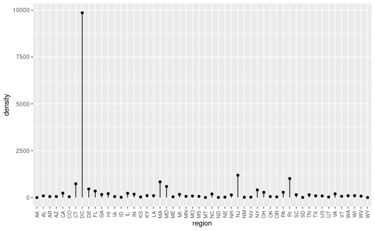
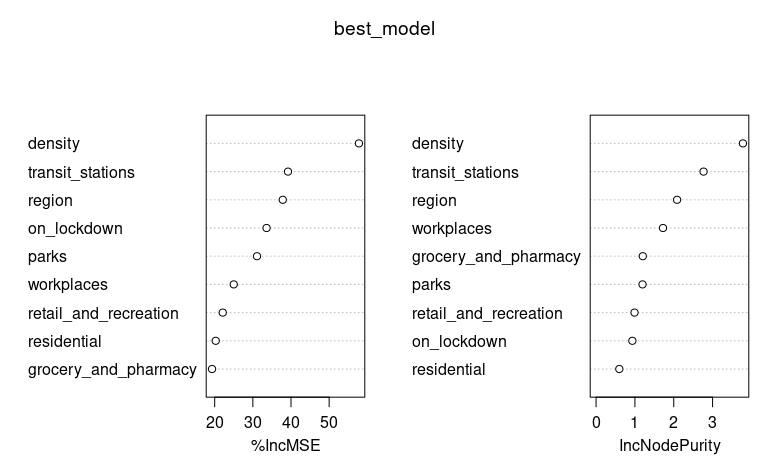
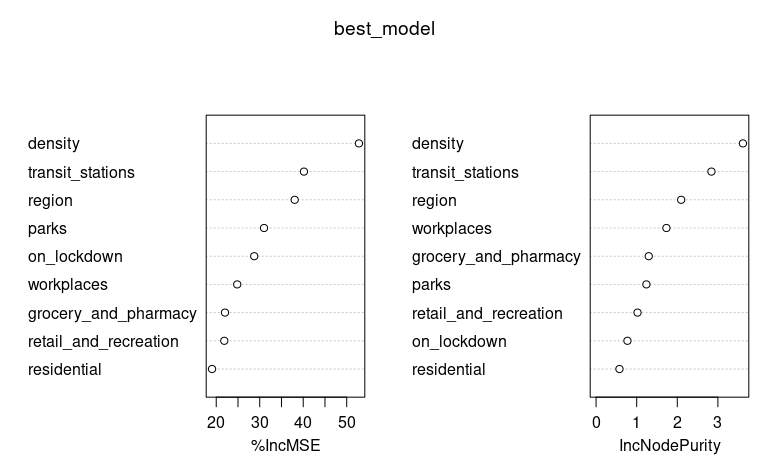
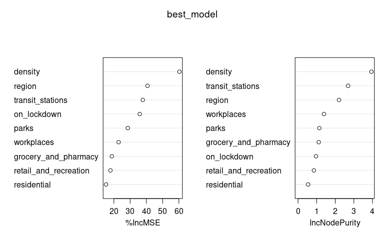
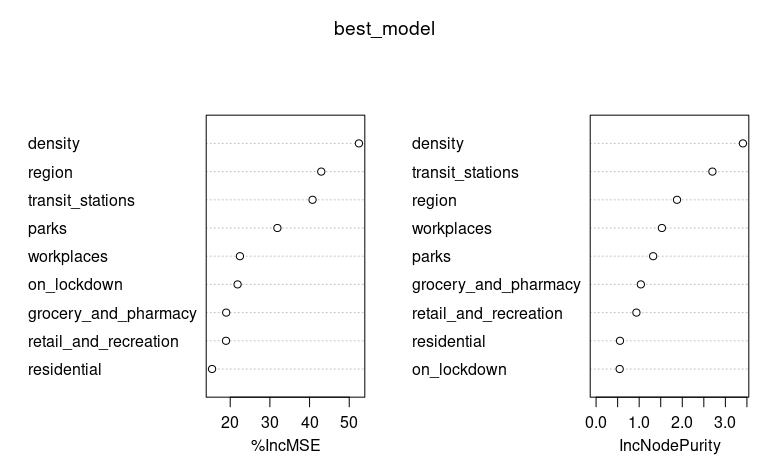

    ## $country_region_code
    ## [1] 0
    ## 
    ## $country_region
    ## [1] 0
    ## 
    ## $sub_region_1
    ## [1] 76
    ## 
    ## $sub_region_2
    ## [1] 3952
    ## 
    ## $date
    ## [1] 0
    ## 
    ## $retail_and_recreation_percent_change_from_baseline
    ## [1] 45790
    ## 
    ## $grocery_and_pharmacy_percent_change_from_baseline
    ## [1] 51807
    ## 
    ## $parks_percent_change_from_baseline
    ## [1] 151545
    ## 
    ## $transit_stations_percent_change_from_baseline
    ## [1] 125738
    ## 
    ## $workplaces_percent_change_from_baseline
    ## [1] 9634
    ## 
    ## $residential_percent_change_from_baseline
    ## [1] 111643

# Examining the *unprocessed* Google mobility data for the United States

    ## [1] "United States"

    ##  [1] NA                     "Alabama"              "Alaska"               "Arizona"             
    ##  [5] "Arkansas"             "California"           "Colorado"             "Connecticut"         
    ##  [9] "Delaware"             "District of Columbia" "Florida"              "Georgia"             
    ## [13] "Hawaii"               "Idaho"                "Illinois"             "Indiana"             
    ## [17] "Iowa"                 "Kansas"               "Kentucky"             "Louisiana"           
    ## [21] "Maine"                "Maryland"             "Massachusetts"        "Michigan"            
    ## [25] "Minnesota"            "Mississippi"          "Missouri"             "Montana"             
    ## [29] "Nebraska"             "Nevada"               "New Hampshire"        "New Jersey"          
    ## [33] "New Mexico"           "New York"             "North Carolina"       "North Dakota"        
    ## [37] "Ohio"                 "Oklahoma"             "Oregon"               "Pennsylvania"        
    ## [41] "Rhode Island"         "South Carolina"       "South Dakota"         "Tennessee"           
    ## [45] "Texas"                "Utah"                 "Vermont"              "Virginia"            
    ## [49] "Washington"           "West Virginia"        "Wisconsin"            "Wyoming"

    ## # A tibble: 2,879 x 3
    ##    sub_region_1 sub_region_2        n
    ##    <chr>        <chr>           <int>
    ##  1 Alabama      Autauga County     76
    ##  2 Alabama      Baldwin County     76
    ##  3 Alabama      Barbour County     76
    ##  4 Alabama      Bibb County        76
    ##  5 Alabama      Blount County      76
    ##  6 Alabama      Bullock County     70
    ##  7 Alabama      Butler County      76
    ##  8 Alabama      Calhoun County     76
    ##  9 Alabama      Chambers County    76
    ## 10 Alabama      Cherokee County    76
    ## # … with 2,869 more rows

    ## # A tibble: 52 x 3
    ##    sub_region_1         min        max       
    ##    <chr>                <date>     <date>    
    ##  1 Alabama              2020-02-15 2020-04-30
    ##  2 Alaska               2020-02-15 2020-04-30
    ##  3 Arizona              2020-02-15 2020-04-30
    ##  4 Arkansas             2020-02-15 2020-04-30
    ##  5 California           2020-02-15 2020-04-30
    ##  6 Colorado             2020-02-15 2020-04-30
    ##  7 Connecticut          2020-02-15 2020-04-30
    ##  8 Delaware             2020-02-15 2020-04-30
    ##  9 District of Columbia 2020-02-15 2020-04-30
    ## 10 Florida              2020-02-15 2020-04-30
    ## # … with 42 more rows

# Examining the *processed* Google mobility data for the United States

    ##  [1] "US" "AL" "AK" "AZ" "AR" "CA" "CO" "CT" "DE" "DC" "FL" "GA" "HI" "ID" "IL" "IN" "IA" "KS" "KY" "LA" "ME" "MD"
    ## [23] "MA" "MI" "MN" "MS" "MO" "MT" "NE" "NV" "NH" "NJ" "NM" "NY" "NC" "ND" "OH" "OK" "OR" "PA" "RI" "SC" "SD" "TN"
    ## [45] "TX" "UT" "VT" "VA" "WA" "WV" "WI" "WY"

# Examining the state-level data

    ## $region
    ## [1] 0
    ## 
    ## $date
    ## [1] 0
    ## 
    ## $retail_and_recreation
    ## [1] 0
    ## 
    ## $grocery_and_pharmacy
    ## [1] 0
    ## 
    ## $parks
    ## [1] 1
    ## 
    ## $transit_stations
    ## [1] 0
    ## 
    ## $workplaces
    ## [1] 0
    ## 
    ## $residential
    ## [1] 0
    ## 
    ## $density
    ## [1] 0
    ## 
    ## $lockdown
    ## [1] 0
    ## 
    ## $reopen
    ## [1] 0
    ## 
    ## $on_lockdown
    ## [1] 0

# Examining the \(R_t\) data

    ##  [1] "AK" "AL" "AR" "AZ" "CA" "CO" "CT" "DC" "DE" "FL" "GA" "HI" "IA" "ID" "IL" "IN" "KS" "KY" "LA" "MA" "MD" "ME"
    ## [23] "MI" "MN" "MO" "MS" "MT" "NC" "ND" "NE" "NH" "NJ" "NM" "NV" "NY" "OH" "OK" "OR" "PA" "RI" "SC" "SD" "TN" "TX"
    ## [45] "UT" "VA" "VT" "WA" "WI" "WV" "WY"

    ## [1] 51

# Density by region

# Examining the model data

<!-- TODO -->

# Examining the random forest models

## Plain model (run on entire data set)

    ##                        %IncMSE IncNodePurity
    ## region                42.11227     2.2124293
    ## retail_and_recreation 21.10567     0.9387569
    ## grocery_and_pharmacy  21.59564     1.1398227
    ## parks                 27.72831     1.1424794
    ## transit_stations      39.58341     2.7333732
    ## workplaces            23.41899     1.6775022
    ## residential           18.08569     0.5846772
    ## density               57.26428     3.9522925
    ## on_lockdown           33.67663     0.9604685

## Model excluding DC

    ##                        %IncMSE IncNodePurity
    ## region                39.95501     1.9976989
    ## retail_and_recreation 21.14493     0.9541232
    ## grocery_and_pharmacy  18.13647     1.2151645
    ## parks                 27.46888     1.2504006
    ## transit_stations      35.89401     2.7704141
    ## workplaces            24.14043     1.6086833
    ## residential           18.17174     0.5765509
    ## density               58.27673     3.9734098
    ## on_lockdown           28.75160     0.7902863

## Model excluding NY

    ##                        %IncMSE IncNodePurity
    ## region                40.69612     2.1991896
    ## retail_and_recreation 17.88002     0.8539473
    ## grocery_and_pharmacy  18.75826     1.1106703
    ## parks                 28.53285     1.1455716
    ## transit_stations      37.77372     2.6911677
    ## workplaces            22.90297     1.3923800
    ## residential           15.16633     0.5446283
    ## density               60.35261     3.9449093
    ## on_lockdown           35.90168     0.9634195

## Model excluding highest density states (CT, DC, MA, MD, NJ, and RI)

    ##                        %IncMSE IncNodePurity
    ## region                42.89877     1.8892529
    ## retail_and_recreation 20.57891     0.8872151
    ## grocery_and_pharmacy  15.82297     0.9639224
    ## parks                 28.67785     1.2482636
    ## transit_stations      40.42258     2.7544549
    ## workplaces            22.94954     1.5191074
    ## residential           15.76596     0.5120935
    ## density               55.19075     3.6849862
    ## on_lockdown           22.25089     0.5530315

# Session info

    ## R version 4.0.0 (2020-04-24)
    ## Platform: x86_64-pc-linux-gnu (64-bit)
    ## Running under: Ubuntu 20.04 LTS
    ## 
    ## Matrix products: default
    ## BLAS:   /usr/lib/x86_64-linux-gnu/blas/libblas.so.3.9.0
    ## LAPACK: /usr/lib/x86_64-linux-gnu/lapack/liblapack.so.3.9.0
    ## 
    ## locale:
    ##  [1] LC_CTYPE=en_US.UTF-8       LC_NUMERIC=C               LC_TIME=en_US.UTF-8        LC_COLLATE=en_US.UTF-8    
    ##  [5] LC_MONETARY=en_US.UTF-8    LC_MESSAGES=en_US.UTF-8    LC_PAPER=en_US.UTF-8       LC_NAME=C                 
    ##  [9] LC_ADDRESS=C               LC_TELEPHONE=C             LC_MEASUREMENT=en_US.UTF-8 LC_IDENTIFICATION=C       
    ## 
    ## attached base packages:
    ## [1] stats     graphics  grDevices utils     datasets  methods   base     
    ## 
    ## other attached packages:
    ##  [1] tidyselect_1.0.0    rmarkdown_2.1       rlang_0.4.6         randomForest_4.6-14 lubridate_1.7.8    
    ##  [6] forcats_0.5.0       stringr_1.4.0       dplyr_0.8.5         purrr_0.3.4         readr_1.3.1        
    ## [11] tidyr_1.0.3         tibble_3.0.1        ggplot2_3.3.0       tidyverse_1.3.0     drake_7.12.0       
    ## 
    ## loaded via a namespace (and not attached):
    ##  [1] Rcpp_1.0.4.6      txtq_0.2.0        lattice_0.20-41   prettyunits_1.1.1 assertthat_0.2.1  digest_0.6.25    
    ##  [7] utf8_1.1.4        R6_2.4.1          cellranger_1.1.0  backports_1.1.6   reprex_0.3.0      evaluate_0.14    
    ## [13] httr_1.4.1        pillar_1.4.4      progress_1.2.2    readxl_1.3.1      rstudioapi_0.11   labeling_0.3     
    ## [19] igraph_1.2.5      munsell_0.5.0     broom_0.5.6       compiler_4.0.0    modelr_0.1.7      xfun_0.13        
    ## [25] pkgconfig_2.0.3   htmltools_0.4.0   fansi_0.4.1       crayon_1.3.4      dbplyr_1.4.3      withr_2.2.0      
    ## [31] grid_4.0.0        nlme_3.1-147      jsonlite_1.6.1    gtable_0.3.0      lifecycle_0.2.0   DBI_1.1.0        
    ## [37] magrittr_1.5      storr_1.2.1       scales_1.1.0      cli_2.0.2         stringi_1.4.6     farver_2.0.3     
    ## [43] fs_1.4.1          xml2_1.3.2        ellipsis_0.3.0    filelock_1.0.2    generics_0.0.2    vctrs_0.2.4      
    ## [49] tools_4.0.0       glue_1.4.0        hms_0.5.3         parallel_4.0.0    yaml_2.2.1        colorspace_1.4-1 
    ## [55] base64url_1.4     rvest_0.3.5       knitr_1.28        haven_2.2.0
