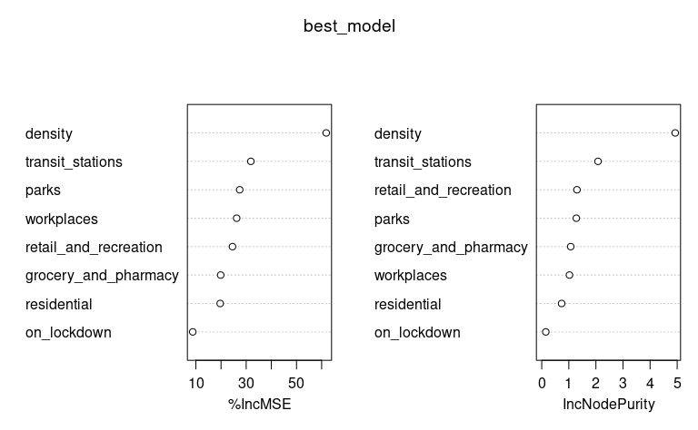
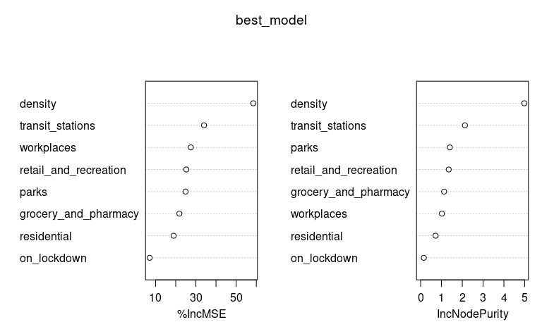
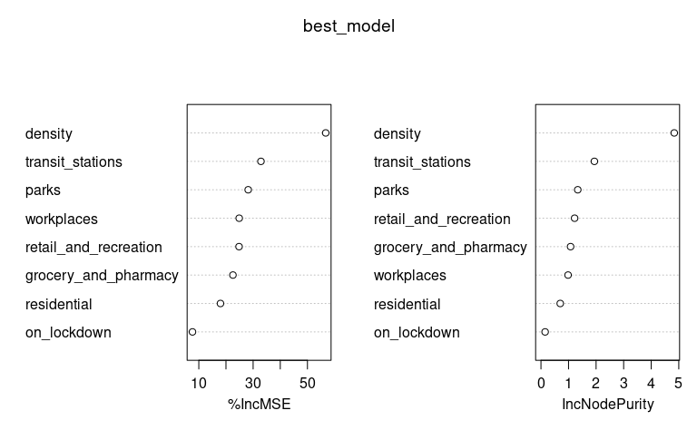
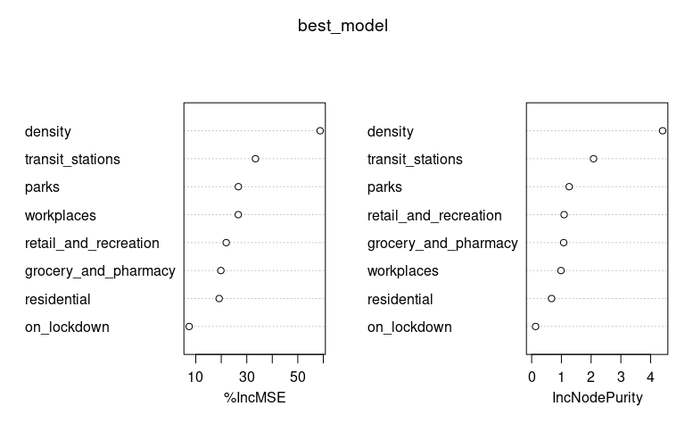

# Random forest models – without regions, with lockdown indicator

Just the raw variable importance measures for now. Random forest models
were fit to the data after lagging the explanatory variables by 0, 1, …,
14 days. In each case below we just look at the model with the the
lowest MSE when fit to the data.

## Plain model (run on entire data set)

Lag that gave lowest MSE.

``` r
model_list <- rf_model_list$plain
mse_scores <- model_list %>% map(~ .x$mse)
which.min(mse_scores) - 1
```

    ## [1] 14

``` r
best_model <- model_list[[which.min(mse_scores)]]$model
importance(best_model)
```

    ##                        %IncMSE IncNodePurity
    ## retail_and_recreation 24.64203     1.4340182
    ## grocery_and_pharmacy  21.93178     1.2753291
    ## parks                 28.91995     1.6453240
    ## transit_stations      37.32778     2.3557081
    ## workplaces            26.86006     1.4587933
    ## residential           18.28193     0.8864601
    ## density               59.34444     5.1983144
    ## on_lockdown           20.37350     0.3912357

``` r
varImpPlot(best_model)
```



## Model excluding DC

Lag that gave lowest MSE.

``` r
model_list <- rf_model_list$no_dc
mse_scores <- model_list %>% map(~ .x$mse)
which.min(mse_scores) - 1
```

    ## [1] 14

``` r
best_model <- model_list[[which.min(mse_scores)]]$model
importance(best_model)
```

    ##                        %IncMSE IncNodePurity
    ## retail_and_recreation 23.96414     1.3668245
    ## grocery_and_pharmacy  23.82307     1.3260801
    ## parks                 30.03639     1.6741650
    ## transit_stations      40.14725     2.5412751
    ## workplaces            29.34782     1.3992160
    ## residential           21.71722     0.8624009
    ## density               59.05230     4.9990568
    ## on_lockdown           17.95674     0.2930427

``` r
varImpPlot(best_model)
```



## Model excluding NY

Lag that gave lowest MSE.

``` r
model_list <- rf_model_list$no_ny
mse_scores <- model_list %>% map(~ .x$mse)
which.min(mse_scores) - 1
```

    ## [1] 14

``` r
best_model <- model_list[[which.min(mse_scores)]]$model
importance(best_model)
```

    ##                        %IncMSE IncNodePurity
    ## retail_and_recreation 23.96019     1.2814875
    ## grocery_and_pharmacy  22.86414     1.2917601
    ## parks                 33.25022     1.6355525
    ## transit_stations      36.26052     2.3898855
    ## workplaces            26.87249     1.3414256
    ## residential           20.65453     0.8401268
    ## density               66.93071     5.0978488
    ## on_lockdown           18.76532     0.3529259

``` r
varImpPlot(best_model)
```



## Model excluding highest density states (CT, DC, MA, MD, NJ, and RI)

Lag that gave lowest MSE.

``` r
model_list <- rf_model_list$low_density
mse_scores <- model_list %>% map(~ .x$mse)
which.min(mse_scores) - 1
```

    ## [1] 14

``` r
best_model <- model_list[[which.min(mse_scores)]]$model
importance(best_model)
```

    ##                        %IncMSE IncNodePurity
    ## retail_and_recreation 20.91049     1.3479815
    ## grocery_and_pharmacy  20.77960     1.1220820
    ## parks                 30.22284     1.5731188
    ## transit_stations      34.46086     2.4579343
    ## workplaces            27.05291     1.5083569
    ## residential           19.88430     0.8857248
    ## density               53.63399     4.6675407
    ## on_lockdown           13.63031     0.2530948

``` r
varImpPlot(best_model)
```


