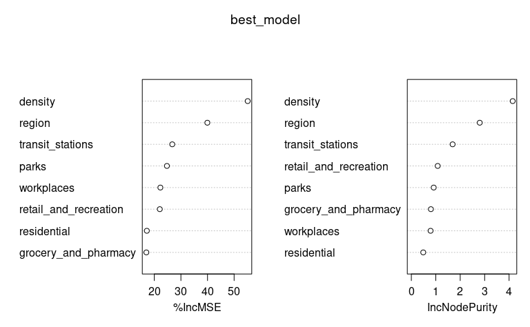
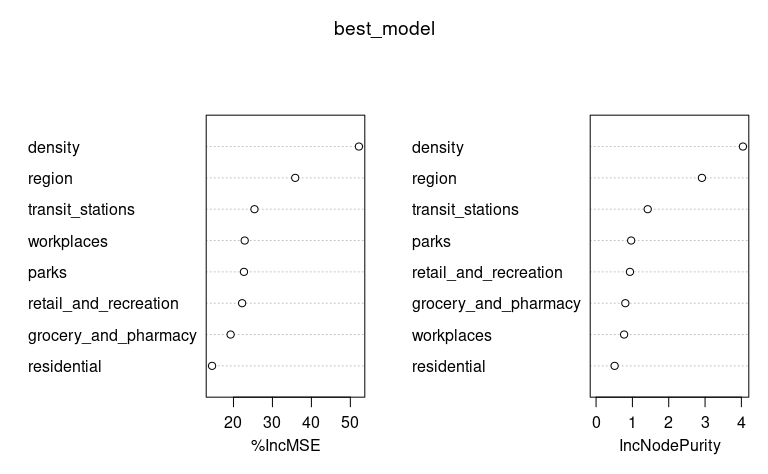
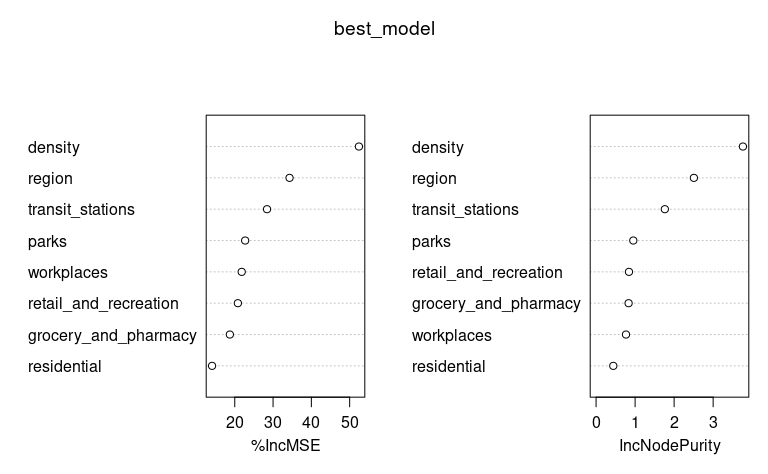

# Random forest models – with regions, without lockdown indicator

Just the raw variable importance measures for now. Random forest models
were fit to the data after lagging the explanatory variables by 0, 1, …,
14 days. In each case below we just look at the model with the the
lowest MSE when fit to the data.

## Plain model (run on entire data set)

Lag that gave lowest MSE.

``` r
model_list <- rf_model_list$plain
mse_scores <- model_list %>% map(~ .x$mse)
which.min(mse_scores) - 1
```

    ## [1] 14

``` r
best_model <- model_list[[which.min(mse_scores)]]$model
importance(best_model)
```

    ##                        %IncMSE IncNodePurity
    ## retail_and_recreation 24.05495     1.1960263
    ## grocery_and_pharmacy  19.32111     1.0107696
    ## parks                 27.05207     1.3552283
    ## transit_stations      29.44385     2.0222596
    ## workplaces            26.81672     1.2423963
    ## residential           15.83620     0.6484277
    ## density               52.92175     4.7420255
    ## region                39.49566     2.5957975

``` r
varImpPlot(best_model)
```



## Model excluding DC

Lag that gave lowest MSE.

``` r
model_list <- rf_model_list$no_dc
mse_scores <- model_list %>% map(~ .x$mse)
which.min(mse_scores) - 1
```

    ## [1] 14

``` r
best_model <- model_list[[which.min(mse_scores)]]$model
importance(best_model)
```

    ##                        %IncMSE IncNodePurity
    ## retail_and_recreation 22.99036     1.2377778
    ## grocery_and_pharmacy  19.08320     1.0563074
    ## parks                 28.84662     1.4289774
    ## transit_stations      30.42884     2.0846201
    ## workplaces            24.35258     1.1913083
    ## residential           15.68579     0.6357324
    ## density               51.79008     4.4108985
    ## region                32.94905     2.6319884

``` r
varImpPlot(best_model)
```


## Model excluding NY

Lag that gave lowest MSE.

``` r
model_list <- rf_model_list$no_ny
mse_scores <- model_list %>% map(~ .x$mse)
which.min(mse_scores) - 1
```

    ## [1] 14

``` r
best_model <- model_list[[which.min(mse_scores)]]$model
importance(best_model)
```

    ##                        %IncMSE IncNodePurity
    ## retail_and_recreation 21.72692     1.1314321
    ## grocery_and_pharmacy  20.61496     0.9964867
    ## parks                 27.01827     1.3390642
    ## transit_stations      30.60631     1.9138691
    ## workplaces            23.07506     1.1600486
    ## residential           12.69616     0.6432676
    ## density               49.20584     4.5610318
    ## region                34.31066     2.6531162

``` r
varImpPlot(best_model)
```



## Model excluding highest density states (CT, DC, MA, MD, NJ, and RI)

Lag that gave lowest MSE.

``` r
model_list <- rf_model_list$low_density
mse_scores <- model_list %>% map(~ .x$mse)
which.min(mse_scores) - 1
```

    ## [1] 14

``` r
best_model <- model_list[[which.min(mse_scores)]]$model
importance(best_model)
```

    ##                        %IncMSE IncNodePurity
    ## retail_and_recreation 20.73617     1.1486194
    ## grocery_and_pharmacy  17.65107     0.9804049
    ## parks                 28.54990     1.2661506
    ## transit_stations      27.84826     2.0552798
    ## workplaces            24.51553     1.2692311
    ## residential           15.63027     0.6410963
    ## density               55.25704     4.0772130
    ## region                31.84740     2.4660601

``` r
varImpPlot(best_model)
```


