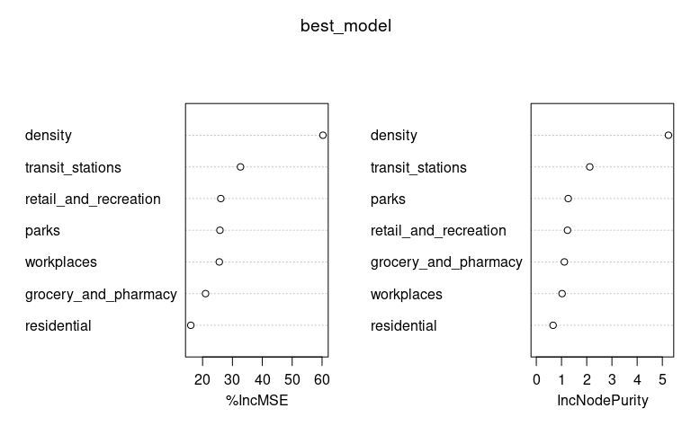

# Random forest models – without regions, without lockdown indicator

Just the raw variable importance measures for now. Random forest models
were fit to the data after lagging the explanatory variables by 0, 1, …,
14 days. In each case below we just look at the model with the the
lowest MSE when fit to the data.

## Plain model (run on entire data set)

Lag that gave lowest MSE.

``` r
model_list <- rf_model_list$plain
mse_scores <- model_list %>% map(~ .x$mse)
which.min(mse_scores) - 1
```

    ## [1] 14

``` r
best_model <- model_list[[which.min(mse_scores)]]$model
importance(best_model)
```

    ##                        %IncMSE IncNodePurity
    ## retail_and_recreation 27.89869     1.4519495
    ## grocery_and_pharmacy  23.37009     1.2410707
    ## parks                 30.19764     1.7074016
    ## transit_stations      33.78977     2.4355500
    ## workplaces            29.06786     1.4829138
    ## residential           20.89848     0.8531485
    ## density               61.43645     5.5303731

``` r
varImpPlot(best_model)
```



## Model excluding DC

Lag that gave lowest MSE.

``` r
model_list <- rf_model_list$no_dc
mse_scores <- model_list %>% map(~ .x$mse)
which.min(mse_scores) - 1
```

    ## [1] 14

``` r
best_model <- model_list[[which.min(mse_scores)]]$model
importance(best_model)
```

    ##                        %IncMSE IncNodePurity
    ## retail_and_recreation 22.66933     1.4458859
    ## grocery_and_pharmacy  21.94913     1.3057709
    ## parks                 31.65624     1.7188323
    ## transit_stations      38.71231     2.4111811
    ## workplaces            31.54490     1.4531027
    ## residential           19.90353     0.8220612
    ## density               61.02455     5.4361519

``` r
varImpPlot(best_model)
```


## Model excluding NY

Lag that gave lowest MSE.

``` r
model_list <- rf_model_list$no_ny
mse_scores <- model_list %>% map(~ .x$mse)
which.min(mse_scores) - 1
```

    ## [1] 14

``` r
best_model <- model_list[[which.min(mse_scores)]]$model
importance(best_model)
```

    ##                        %IncMSE IncNodePurity
    ## retail_and_recreation 26.33751     1.3493183
    ## grocery_and_pharmacy  23.32858     1.2543231
    ## parks                 34.78061     1.6598793
    ## transit_stations      40.11804     2.3811902
    ## workplaces            27.10262     1.3777632
    ## residential           20.46110     0.8250025
    ## density               68.98766     5.4351457

``` r
varImpPlot(best_model)
```


## Model excluding highest density states (CT, DC, MA, MD, NJ, and RI)

Lag that gave lowest MSE.

``` r
model_list <- rf_model_list$low_density
mse_scores <- model_list %>% map(~ .x$mse)
which.min(mse_scores) - 1
```

    ## [1] 14

``` r
best_model <- model_list[[which.min(mse_scores)]]$model
importance(best_model)
```

    ##                        %IncMSE IncNodePurity
    ## retail_and_recreation 22.28435      1.370891
    ## grocery_and_pharmacy  21.77168      1.163000
    ## parks                 31.07377      1.519839
    ## transit_stations      34.44045      2.575603
    ## workplaces            29.90378      1.490715
    ## residential           17.75962      0.811917
    ## density               59.23205      4.961563

``` r
varImpPlot(best_model)
```


